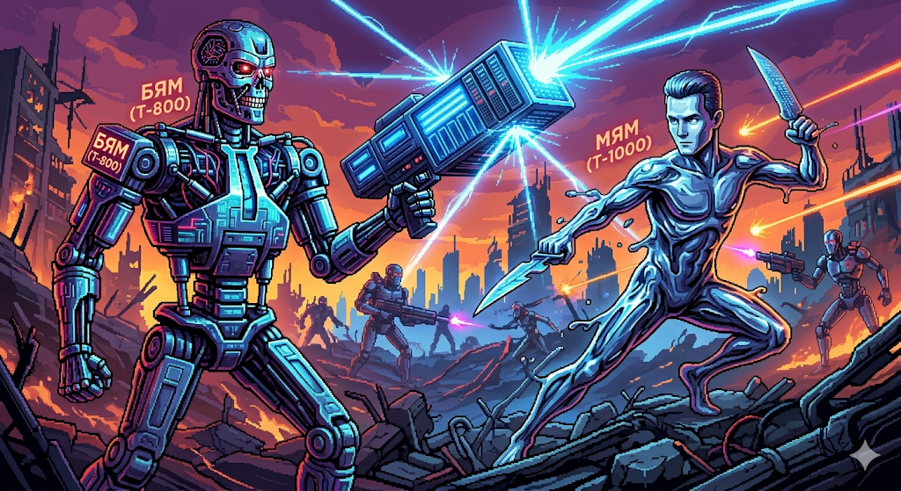

# БЯМ & МЯМ сидели на трубе


БЯМ (Большая Языковая Модель) and МЯМ (Малая Языковая Модель) — Russian shorthand for LLM and SLM, and the name of this **LLM Wiki**: a compounding knowledge base on neural architectures, AI agent workflows, coding methodologies, and the semantic weirdness that emerges when you push tokens through transformers.

## What's inside

- **Architectures** — transformer, positional encoding, KV caching, residual connections, LSTM, backprop
- **Agent methodologies** — vibe coding, contract programming, semantic anchors, semantic superposition
- **Representation phenomena** — superposition, polysemantic neurons, privileged basis, semantic fractal, belief state geometry
- **RAG & knowledge grounding** — retrieval-augmented generation, knowledge graphs, corpus linguistics, distributional semantics
- **Research frontiers** — Coconut (latent reasoning), cognitive superposition, Toy Models of Superposition
- **History & people** — Frank Rosenblatt, Vladimir Ivanov, Anthropic, Microsoft

This is not an academic survey. It's a personal knowledge base that takes provenance seriously — every claim traces back to a raw source.

## Why "disgrace"

Vladimir Ivanov (Turboplanner) has a proprietary agent-driven software methodology called **GRACE**. It's not public. The name of this repo is **dis**-GRACE — an attempt to reverse-engineer and reconstruct the approach from published fragments: his articles on contract programming, semantic anchors, semantic superposition, AI parallelism, and whatever else can be pieced together.

The rest of the wiki (architectures, agent patterns, representations) is the foundation you need to understand why any of that works. GRACE is the target, but the map is the territory.

## Layout

```
├── index.md           — page catalog with one-line summaries
├── SCHEMA.md          — domain rules, tag taxonomy, frontmatter conventions
├── log.md             — append-only changelog
│
├── entities/          — people and organizations (one file per entity)
├── concepts/          — phenomena, techniques, and ideas
│   └── comparisons/   — side-by-side analyses (planned)
│
├── raw/
│   ├── articles/      — blog posts, Wikipedia, news (immutable)
│   └── papers/        — academic publications (immutable)
│
└── raw/assets/        — images for README and wiki pages
```

Every page has YAML frontmatter (type, tags, sources, confidence). Minimum 2 `[[wikilinks]]` per page. Contradictions get flagged (contested: true), not silently overwritten. Everything logged.

## License

Wiki pages (entities/, concepts/, index.md, SCHEMA.md, log.md) are **CC0** — take, fork, reuse.

**`raw/` content is not CC0.** Each source carries its own license (blog terms, publisher copyright, Wikipedia CC-BY-SA, arXiv, etc.). Nothing in `raw/` is transformed or derived — it's archived as-is for provenance tracking.

If you are a rights holder and want your material removed, open an issue or contact me directly. Takedown requests will be honored promptly.

Found a mistake or have a lead on GRACE internals? Open an issue.
