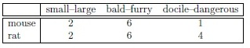
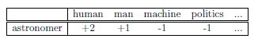
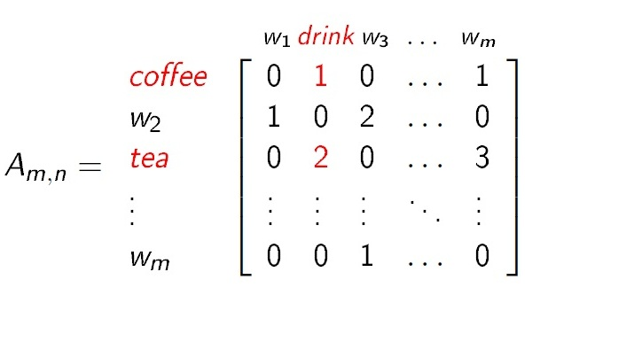
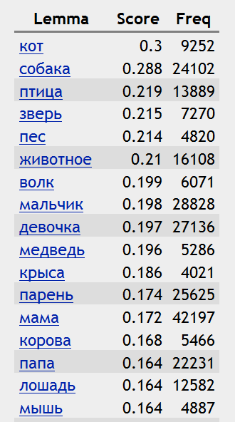
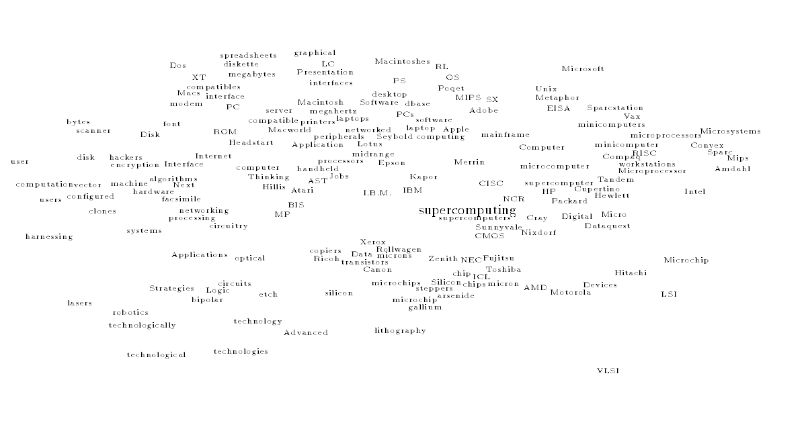

# Дистрибутивная семантика

**Дистрибути́вная сема́нтика** — это область лингвистики, которая занимается вычислением степени семантической близости между лингвистическими единицами на основании их распределения (дистрибуции) в больших массивах лингвистических данных (текстовых корпусах).

Каждому слову присваивается свой *контекстный вектор*. Множество векторов формирует *словесное векторное пространство*.

Семантическое расстояние между понятиями, выраженными словами естественного языка, обычно вычисляется как косинусное расстояние между векторами словесного пространства.

## История

**Дистрибутивный анализ** — это метод исследования языка, основанный на изучении окружения (дистрибуции, распределения) отдельных единиц в тексте и не использующий сведений о полном лексическом или грамматическом значении этих единиц.

В рамках данного метода к текстам изучаемого языка применяется упорядоченный набор универсальных процедур, что позволяет выделить основные единицы языка (фонемы, морфемы, слова, словосочетания), провести их классификацию и установить отношения сочетаемости между ними.

Классификация основывается на принципе замещения: языковые единицы относятся к одному и тому же классу, если они могут выступать в одних и тех же контекстах.

Дистрибутивный анализ был предложен Леонардом Блумфилдом в 20-х гг. XX века и применялся главным образом в фонологии и морфологии.

Зеллиг Харрис и другие представители дескриптивной лингвистики развивали данный метод в своих работах в 30—50-х гг. XX века.

Близкие идеи выдвигали основоположники структурной лингвистики Фердинанд де Соссюр и Людвиг Витгенштейн.

Идея **контекстных векторов** была предложена психолингвистом Чарльзом Осгудом в рамках работ по представлению значений слов. Контексты, в которых встречались слова, выступали в качестве измерений многоразрядных векторов. В качестве таких контекстов в работах Осгуда использовались антонимические пары прилагательных (например, *быстрый-медленный*), для которых участники опроса выставляли оценки по семибалльной шкале.

Пример пространства контекстных признаков, описывающего значение слов *мышь* и *крыса* из работы Осгуда:

Термин **контекстный вектор** был введён С. Галлантом для описания смысла слов и разрешения лексической неоднозначности. В работах Галланта использовалось множество признаков, заданное исследователем, таких как *человек*, *мужчина*, *машина* и т. д.

Пример пространства контекстных признаков, описывающего значение слова *астроном* из работы Галланта:

В течение последних двух десятилетий метод дистрибутивного анализа широко применялся к изучению семантики. Была разработана дистрибутивно-семантическая методика и соответствующее программное обеспечение, которые позволяют автоматически сравнивать контексты, в которых встречаются изучаемые языковые единицы, и вычислять семантические расстояния между ними.

## Дистрибутивная гипотеза

Дистрибутивная семантика основывается на **дистрибутивной гипотезе**: лингвистические единицы, встречающиеся в схожих контекстах, имеют близкие значения.

Психологические эксперименты подтвердили истинность данной гипотезы. Например, в одной из работ участников эксперимента просили высказать своё суждение о синонимичности предъявляемых им пар слов. Данные опроса затем сравнивали с контекстами, в которых встречались изучаемые слова. Эксперимент показал наличие положительной корреляции между семантической близостью слов и схожестью контекстов, в которых они встречаются.

## Математическая модель

В качестве способа представления модели используются векторные пространства из линейной алгебры. Информация о дистрибуции лингвистических единиц представляется в виде многоразрядных векторов, которые образуют словесное векторное пространство. Векторы соответствуют лингвистическим единицам (словам или словосочетаниям), а измерения соответствуют контекстам. Координаты векторов представляют собой числа, показывающие, сколько раз данное слово или словосочетание встретилось в данном контексте.

Пример словесного векторного пространства, описывающего дистрибутивные характеристики слов *tea* и *coffee*, в котором контекстом выступает соседнее слово:

Размер контекстного окна определяется целями исследования:

- установление синтагматических связей — 1-2 слова
- установление парадигматических связей — 5-10 слов
- установление тематических связей — 50 слов и больше

Семантическая близость между лингвистическими единицами вычисляется как расстояние между векторами. В исследованиях по дистрибутивной семантике чаще всего используется косинусная мера, которая вычисляется по формуле:

$cos(A,B) = \frac{\sum_{i=1}^{n} A_i \times B_i}{\sqrt{\sum_{i=1}^{n} (A_i)^2} \times \sqrt{\sum_{i=1}^{n} (B_i)^2}}$

где A и B — два вектора, расстояние между которыми вычисляется.

После проведения подобного анализа становится возможным выявить наиболее близкие по смыслу слова по отношению к изучаемому слову. Пример наиболее близких слов к слову *кошка* (список получен на основании данных веб-корпуса русского языка, обработка корпуса выполнена системой Sketch Engine):

В графическом виде слова могут быть представлены как точки на плоскости, при этом точки, соответствующие близким по смыслу словам, расположены близко друг к другу.

Пример словесного пространства, описывающего предметную область *суперкомпьютеры*, из работы Генриха Шутце:

## Модели дистрибутивной семантики

Существует множество различных моделей дистрибутивной семантики, которые различаются по следующим параметрам:

- тип контекста: размер контекста, правый или левый контекст, ранжирование
- количественная оценка частоты встречаемости слова в данном контексте: абсолютная частота, TF-IDF, энтропия, совместная информация и пр.
- мера расстояния между векторами: косинус, скалярное произведение, расстояние Минковского и пр.
- метод уменьшения размерности матрицы: случайная проекция, сингулярное разложение, случайное индексирование и пр.

Наиболее широко известны следующие дистрибутивно-семантические модели:

- Модель векторных пространств
- Латентно-семантический анализ (LSA)
- Тематическое моделирование
- Предсказательные модели (word2vec и др.)

## Уменьшение размерности векторных пространств

При применении дистрибутивно-семантических моделей в реальных приложениях возникает проблема слишком большой размерности векторов, соответствующей огромному числу контекстов, представленных в текстовом корпусе. Возникает необходимость в применении специальных методов, которые позволяют уменьшить размерность и разреженность векторного пространства и при этом сохранить как можно больше информации из исходного векторного пространства. Получающиеся в результате сжатые векторные представления слов в англоязычной терминологии носят название **word embeddings**.

Методы уменьшения размерности векторных пространств:

- удаление определенных измерений векторов в соответствии с лингвистическими или статистическими критериями
- сингулярное разложение (SVD)
- метод главных компонент (PCA)
- случайное индексирование

## Предсказательные модели дистрибутивной семантики

Ещё один способ получения векторов малой размерности — машинное обучение, в частности искусственные нейронные сети. При обучении таких *предсказательных моделей* (англ. predictive models) целевым представлением каждого слова также является сжатый вектор относительно небольшого размера (англ. embedding), для которого в ходе множественных проходов по обучающему корпусу максимизируется сходство с векторами соседей и минимизируется сходство с векторами слов, его соседями не являющихся. Однако, в отличие от традиционных *счётных моделей* (англ. count models), в данном подходе отсутствует стадия снижения размерности вектора, поскольку модель изначально инициализируется с векторами небольшой размерности (порядка нескольких сотен компонентов).

Подобные предсказательные модели представляют семантику естественного языка более точно, чем счётные модели, не использующие машинное обучение.

Наиболее известные представители подобного подхода — алгоритмы *Continuous Bag-of-Words (CBOW)* и *Continuous Skipgram*, впервые реализованные в утилите word2vec, представленной в 2013 году. Пример применения подобных моделей к русскому языку представлен на веб-сервисе RusVectōrēs (http://rusvectores.org).

## Области применения

Модели дистрибутивной семантики нашли применение в исследованиях и практических реализациях, связанных с семантическими моделями естественного языка:

- выявление семантической близости слов и словосочетаний
- автоматическая кластеризация слов по степени их семантической близости
- автоматическая генерация тезаурусов и двуязычных словарей
- разрешение лексической неоднозначности
- расширение запросов за счет ассоциативных связей
- определение тематики документа
- кластеризация документов для информационного поиска
- извлечение знаний из текстов
- построение семантических карт различных предметных областей
- моделирование перифраз
- определение тональности высказывания
- моделирование сочетаемостных ограничений слов

## Программы

Существует несколько программных средств для проведения исследований по дистрибутивной семантике с открытым кодом:

- [S-Space](https://github.com/fozziethebeat/S-Space/)
- [Semantic Vectors](https://code.google.com/p/semanticvectors/)
- [Gensim](http://radimrehurek.com/gensim)
- [word2vec](https://code.google.com/p/word2vec)
- [WebVectors](https://github.com/akutuzov/webvectors)

## См. также

- Векторное представление слов (word embeddings)
- Word2vec
